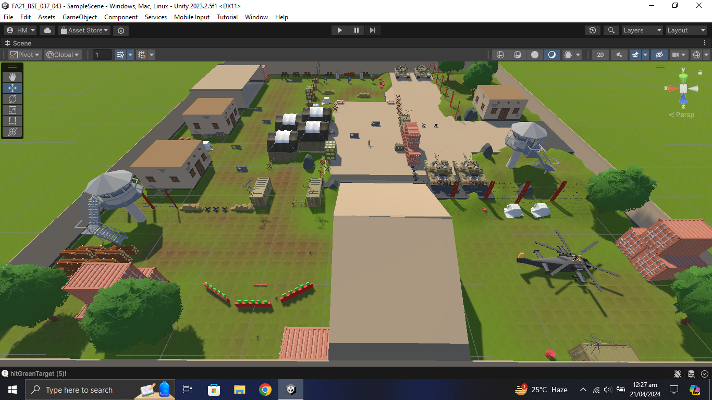

# My Channel on Unity Play:
https://play.unity.com/en/user/c9444cda-3bf0-4586-9832-f6e7fb7fa838

# Combat Escape (FPS)

# Description:

Character: Captain Alex

Motivation: Players assume the role of Captain Alex, escaping an enemy military base to uncover the truth and fight for freedom.

Theme: Sacrifice and Heroism 
Alex's journey is defined by acts of sacrifice and heroism, putting himself in danger to protect others and secure a brighter future.

Levels:

Level 1: Military Base Escape
- Objective: Navigate the enemy-infested military base to reach the extraction point.
- Challenges: Evade security systems, overcome enemy resistance, and confront SWAT enemies.
- Climax: Escape by jumping into the water amid intense opposition.

Level 2: Escape Across the Open Sea
- Objective: Navigate hostile waters to reach safety.
- Challenges: Outmaneuver enemy vessels, navigate turbulent waters, and fend off SWAT attacks.
- Climax: Successfully reach distant shores, overcoming environmental hazards and enemy threats.

Character Animations:
- Weapon Recoil Animation: Enhances combat immersion.
- Weapon Reload Animation: Smooth reloading for seamless transitions.
- Player Death Animation: Emphasizes consequences and evokes emotion.

Enemies:

SWAT Enemy:
- Description: Highly trained, armored forces with advanced weaponry.
- Damage Inflicted: Each hit deducts 10 points from player health.
- Health: 100 points initially.
- Damage Received: Each bullet hit reduces enemy health by 25 points; perishes after 4 hits.
- Incentives: Defeating a SWAT enemy grants a 10-ammo drop for resource sustainability.

Health Management:
- Enemy Attacks: Each enemy bullet reduces player health by 10 points.
- Health Regeneration: Health regenerates by 5 points every 2 seconds when it falls to or below 30 points, until it reaches 50 points. This encourages strategic health management.

This project aims to create a compelling gaming experience, highlighting sacrifice and heroism through challenging gameplay, realistic animations, and strategic health management.

Level 1

Level 2

Game Menu Scene

Game Over Scene

Play Again Scene

# My Channel on Unity Play:
https://play.unity.com/en/user/c9444cda-3bf0-4586-9832-f6e7fb7fa838
